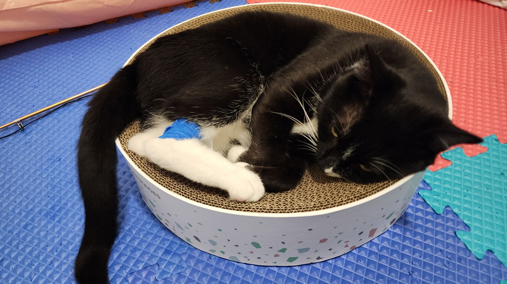
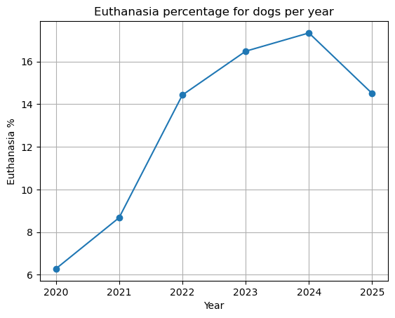
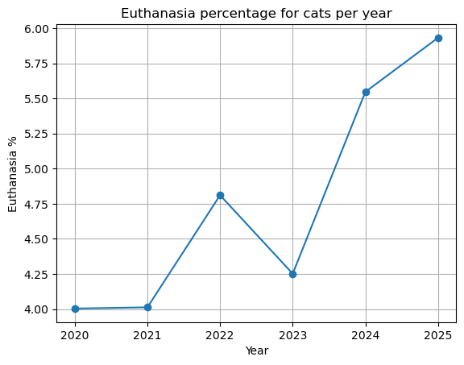

This is Jupiter, a 3 year old male cat, who would not be with us today if not for the two volunteers who devoted weeks to rehabilitate him and find him a new home. 

Jupiter was on the euthanasia list, like many other innocent cats, who end up on the list due to no fault of their own. 

According to publicly available data on the [City of Albuquerque's website](https://newpublicreports.cabq.gov/ibmcognos/bi/?perspective=classicviewer&pathRef=.public_folders%2FAnimal%20Welfare%2FAnimal%20Arrival%20Report&id=iD8EBA2931105497A9DB7986C6FD763C5&objRef=iD8EBA2931105497A9DB7986C6FD763C5&action=run&format=HTML&prompt=true&cmPropStr=%7B%22id%22%3A%22iD8EBA2931105497A9DB7986C6FD763C5%22%2C%22type%22%3A%22report%22%2C%22defaultName%22%3A%22Animal%20Arrival%20Report%22%2C%22permissions%22%3A%5B%22execute%22%2C%22read%22%2C%22traverse%22%5D%7D), over 5% of admitted cats end up on the list. This number is higher for dogs, at almost 15%. 

 
Between January 2020 and July 2025, the City of Albuquerque Animal Welfare Department admitted **52,927** dogs and **39,998** cats. Of these, 57.66% of dogs (27,830) and 65.97% of cats (22,615) found new homes through adoption. Additionally, 22.06% of dogs and 24.3% of cats were reunited with their families through reclaim efforts, while 5.78% of dogs and 4.29% of cats entered foster care.

Unfortunately, 6,998 dogs and 1,865 cats were humanely euthanized. These heartbreaking decisions often stem from untreatable medical conditions, severe behavioral challenges, psychological decline, or critical resource shortages.

| Species | Total Admitted | Adopted (%)       | Reclaimed (%)     | Fostered (%)     | Euthanized (%)      |
|---------|----------------|-------------------|--------------------|------------------|---------------------|
| Dogs    | 52,927         | 27,830 (57.66%)   | 11,670 (22.06%)    | 3,059 (5.78%)    | 6,998 (13.22%)      |
| Cats    | 39,998         | 22,615 (65.97%)   | 9,717 (24.3%)      | 1,716 (4.29%)    | 1,865 (4.66%)       |

The following plots show the trend in the past 5 years. While the rate fluctuates for cats, we see a clear and steady increase for dogs.

## But it doesn’t have to end this way.

With compassion and commitment, many of these barriers can be overcome. Volunteers play a vital role in helping animals heal, trust again, and find loving homes. Their time and care can be the difference between life and loss.

## So why not lend a hand? Because one life lost is one too many. ##

# Volunteer Sign-Up Sheet

Please fill in your information below if you're interested in supporting our animal welfare efforts!

| Name             | Phone Number     | Email Address        | Interested in Dogs, Cats, or Both? |
|------------------|------------------|-----------------------|-------------------------------------|
|                  |                  |                       |                                     |
|                  |                  |                       |                                     |
|                  |                  |                       |                                     |
|                  |                  |                       |                                     |
|                  |                  |                       |                                     |
